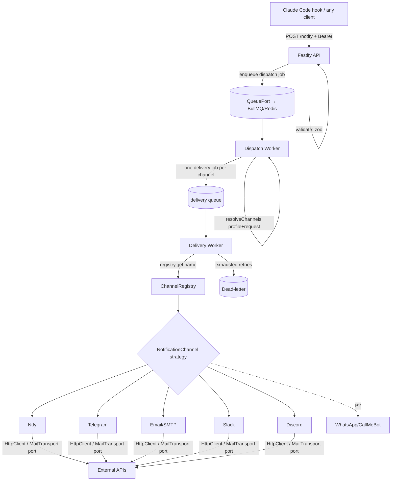

# Notification Gateway Design

**Spec**: `.specs/features/notification-gateway/spec.md`
**Context**: `.specs/features/notification-gateway/context.md`
**Status**: Approved — Approach 1 (two-stage queue) confirmed

---

## Design Goals (from user)

1. **Mockable** — every external seam (HTTP, queue, SMTP, clock, logger) is an injected interface; tests use fakes, no network/Redis required.
2. **Same interface for every channel** — one `NotificationChannel` contract; ntfy, Telegram, e-mail, Slack, Discord, WhatsApp all implement it identically.
3. **Pluggable** — adding "one more way to notify" is: implement the interface + register one line. No core edits.

## Pattern Stack (the answer to "which design pattern")

| Pattern | Where | Why it fits |
| ------- | ----- | ----------- |
| **Strategy** | `NotificationChannel` implementations | Each channel is an interchangeable delivery strategy chosen at runtime by name |
| **Adapter** | Each channel + queue impls | Wraps an external API (ntfy/Telegram/SMTP/BullMQ) behind our own interface |
| **Factory + Registry** | `channelRegistry` + `ChannelBuilder` | One central `name → factory` map; enabled channels are built from config. **This is the pluggability seam** |
| **Decorator** | `TruncatingChannel`, `LoggingChannel` | Cross-cutting behavior (truncate to limit, structured logging) composed around any channel without touching adapters |
| **Ports & Adapters (Hexagonal)** | `QueuePort`, `HttpClient`, `MailTransport`, `Clock`, `Logger` | Core domain depends on interfaces, not concretes → **mockable** |
| **Dependency Injection** | `buildContainer()` composition root | Single wiring place; tests pass `overrides` with fakes |
| **Result object** | `DeliveryResult` | Per-channel outcome as data, not exceptions → clean partial-failure isolation |

> Strategy + Factory (your intuition) is the core; Decorator + Ports&Adapters are what make it *mockable* and *endlessly pluggable*.

---

## Architecture Overview



**Flow:** client → API (auth + validate) → enqueue → dispatch worker resolves the channel set → one delivery job per channel → delivery worker looks up the channel strategy in the registry and sends via an injected transport. Retry + dead-letter are per-channel (no duplicate sends).

---

## Approach Options (confirm one before Tasks)

Both keep the **identical pattern stack** above (Strategy + Registry-Factory + Decorator + Ports). They differ only in **queue topology / where retry lives**.

### Approach 1 — Two-stage queue, retry at queue level ⭐ Recommended
- API enqueues a **dispatch** job → dispatch worker fans out into **one delivery job per channel** → delivery worker sends.
- Retry/backoff/dead-letter = **native BullMQ** job options, **per channel**.
- **Pros:** no duplicate sends on retry (a succeeded channel is never re-sent); per-channel dead-letter for free; best observability; idiomatic BullMQ.
- **Cons:** two queues (marginally more infra/code).

### Approach 2 — Single queue, retry as a Decorator
- API enqueues one job → worker fans out inline with `Promise.allSettled`; a `RetryingChannel` decorator does per-channel retry; a custom list holds dead-letters.
- **Pros:** one queue; retry becomes a composable decorator (elegant demo of the pattern).
- **Cons:** you hand-roll dead-letter; job-level retry MUST be disabled (attempts=1) or a succeeded channel gets re-sent → duplicate-send risk to guard manually.

**Recommendation: Approach 1** — the reliability guarantee (no duplicate sends + per-channel DLQ) is worth one extra queue, and it keeps retry out of the channel code so adapters stay tiny. Rest of this doc assumes Approach 1; switching to 2 only changes the two worker components, not the interfaces.

---

## Code Reuse Analysis

Greenfield repo — nothing internal to reuse yet. External libraries to leverage (versions/exact APIs verified at implementation via Context7/official docs — not fabricated here):

| Library | Role | Notes |
| ------- | ---- | ----- |
| `fastify` | HTTP API | Lightweight, first-class TS, preHandler hooks for auth |
| `bullmq` | Queue + workers over Redis | Native retries (`attempts`, `backoff`), dead-letter via failed set / DLQ pattern |
| `ioredis` | Redis client (BullMQ dep) | Shared connection |
| `zod` | Payload + env validation | Fail-fast config + request `400`s |
| `undici` / global `fetch` | `HttpClient` impl for webhook channels | Node 20+ has global fetch; wrap behind our port |
| `nodemailer` | `MailTransport` impl for Email | Wrapped behind port; SMTP creds via env |
| `pino` | `Logger` impl | Structured logs |

### Integration Points

| System | Integration |
| ------ | ----------- |
| ntfy (self-host or ntfy.sh) | HTTP POST publish to topic |
| Telegram Bot API | HTTP POST `sendMessage` |
| SMTP server | nodemailer transport |
| Slack / Discord | Incoming webhook POST |
| CallMeBot (WhatsApp, P2) | HTTP GET/POST with phone+apikey |
| Claude Code | Hooks in `~/.claude/settings.json` invoke the hook client |

---

## Core Interfaces (contracts first)

```typescript
// ---- Domain value objects ----
type Priority = 'low' | 'default' | 'high' | 'urgent'

interface Notification {
  title: string
  message: string
  priority?: Priority
  tags?: string[]
  // event, project, durationMs, timestamp, sessionId, etc.
  metadata?: Record<string, unknown>
}

interface DeliveryResult {
  channel: string
  ok: boolean
  error?: string
  attempts: number
  durationMs: number
}

interface Profile {
  name: string
  token: string
  defaultChannels: string[]
}

// ---- Strategy: every channel implements exactly this ----
interface NotificationChannel {
  readonly name: string
  /** Sends or throws. Throw = failure (queue/decorator handles retry). */
  send(notification: Notification): Promise<void>
}

// ---- Factory + Registry (the pluggable seam) ----
interface ChannelDeps {
  http: HttpClient
  mail: MailTransport
  logger: Logger
}
type ChannelFactory = (cfg: Record<string, string>, deps: ChannelDeps) => NotificationChannel

interface ChannelRegistryEntry {
  factory: ChannelFactory
  requiredConfig: string[] // env keys that MUST be present when enabled
}

// ---- Ports (mockable seams) ----
interface HttpClient {
  request(opts: { method: string; url: string; headers?: Record<string,string>; body?: unknown }):
    Promise<{ status: number; body: string }>
}
interface MailTransport {
  send(msg: { to: string; subject: string; text: string }): Promise<void>
}
interface QueuePort {
  enqueueDispatch(job: DispatchJob): Promise<{ jobId: string }>
  enqueueDelivery(job: DeliveryJob): Promise<{ jobId: string }>
  onDispatch(handler: (job: DispatchJob) => Promise<void>): void
  onDelivery(handler: (job: DeliveryJob) => Promise<void>): void
  health(): Promise<boolean>
  close(): Promise<void>
}
interface TokenResolver { resolve(token: string | undefined): Profile | null }
interface Clock { now(): number }
interface Logger { info(o: unknown, m?: string): void; warn(o: unknown, m?: string): void; error(o: unknown, m?: string): void }
```

**Mockability contract:** no component constructs its own dependencies. Adapters get `HttpClient`/`MailTransport`; the queue is a `QueuePort`; time is a `Clock`. Tests inject fakes — zero network, zero Redis, zero SMTP.

---

## Components

### 1. Composition Root — `src/container.ts`
- **Purpose**: Wire everything; the only place concretes are instantiated.
- **Interfaces**: `buildContainer(config: AppConfig, overrides?: Partial<Deps>): Container`
- **Dependencies**: all ports + ChannelBuilder.
- **Reuses**: —. Tests call `buildContainer(cfg, { http: fakeHttp, queue: inMemoryQueue })`.

### 2. Config Loader — `src/config/load-config.ts`
- **Purpose**: Parse + zod-validate env → typed `AppConfig`; run fail-fast channel-credential check.
- **Interfaces**: `loadConfig(env: NodeJS.ProcessEnv): AppConfig` (throws with channel+key name if an enabled channel lacks a required credential — NOTIF-10).
- **Reuses**: zod, `channelRegistry.requiredConfig`.

### 3. Channel Strategy + Registry — `src/channels/`
- **Purpose**: The Strategy interface, all adapters, and the registry/factory + decorators.
- **Files**: `notification-channel.ts` (interface), `channel-registry.ts` (the `name→entry` map + `ChannelBuilder.buildActive`), `decorators/truncating-channel.ts`, `decorators/logging-channel.ts`, and `adapters/{ntfy,telegram,email,slack,discord,whatsapp,webhook}-channel.ts`.
- **Interfaces**: `ChannelBuilder.buildActive(enabled: string[], cfg, deps): Map<string, NotificationChannel>` — unknown name → throw; missing cred → throw; else factory → wrap decorators → map.
- **Reuses**: `HttpClient`, `MailTransport`.
- **Pluggability**: new channel = new adapter file + one `channelRegistry[name] = {...}` line.

### 4. Dispatch Service — `src/dispatch/dispatch-service.ts`
- **Purpose**: Resolve the channel set and fan out into per-channel delivery jobs.
- **Interfaces**:
  - `resolveChannels(profile: Profile, requested?: string[], active: Set<string>): string[]` — requested ∩ active, else profile.defaultChannels ∩ active.
  - `handleDispatch(job: DispatchJob): Promise<void>` — enqueue one `DeliveryJob` per resolved channel; empty set → log no-op (NOTIF-03.4).
- **Dependencies**: `QueuePort`, `Logger`.

### 5. Delivery Service — `src/delivery/delivery-service.ts`
- **Purpose**: Send one notification via one channel; produce a `DeliveryResult`.
- **Interfaces**: `deliver(job: DeliveryJob): Promise<void>` — `registry.get(name).send(n)`; throw on failure so BullMQ retries; exhausted → dead-letter (NOTIF-02).
- **Dependencies**: active channels map, `Clock`, `Logger`.

### 6. HTTP API — `src/api/`
- **Purpose**: `POST /notify`, `GET /health`, (`GET /jobs/:id` P2).
- **Files**: `server.ts`, `routes/notify.ts`, `routes/health.ts`, `plugins/auth.ts` (Bearer preHandler via `TokenResolver`), `schemas/notify-schema.ts` (zod).
- **Interfaces**: `POST /notify` → 202 `{jobId}` | 400 | 401 | 503 (NOTIF-01, 14).
- **Dependencies**: `TokenResolver`, `QueuePort`, zod schema, active-channel names (to reject unknown `channels` with 400).

### 7. Queue Adapters — `src/queue/`
- **Purpose**: `QueuePort` implementations.
- **Files**: `bullmq-queue.ts` (prod: two BullMQ queues + workers, `attempts`/`backoff`/DLQ), `in-memory-queue.ts` (tests: runs handlers synchronously, no Redis).
- **Dependencies**: bullmq/ioredis (prod only).

### 8. Entrypoints — `src/bin/`
- `api.ts` (starts Fastify + dispatch producer), `worker.ts` (registers dispatch + delivery workers). Both call `buildContainer`.

### 9. Claude Code Hook Client — `clients/claude-code/notify-hook.mjs`
- **Purpose**: Read hook JSON from stdin, build payload, POST to gateway; **always exit 0** (NOTIF-13).
- **Behavior**: event = map(`hook_event_name`): `UserPromptSubmit`→start, `Stop`→end, `Notification`→needs-input; each gated by an env toggle. project = basename(cwd); summary = last assistant message from transcript (best-effort); duration = now − cached start-time for `session_id` (best-effort); timestamp = now.
- **Files**: `notify-hook.mjs`, `install.md` (+ `settings.json` snippet), `.env.example`.
- **Dependencies**: none beyond Node stdlib + `fetch` (zero npm deps so it runs anywhere).

---

## Data Models

```typescript
interface AppConfig {
  port: number
  redisUrl: string
  profiles: Profile[]              // parsed from TOKENS
  channelsEnabled: string[]        // CHANNELS_ENABLED
  channelConfig: Record<string, Record<string,string>>  // per-channel creds
  retry: { attempts: number; backoffMs: number }
}

interface DispatchJob {
  notification: Notification
  profileName: string
  requestedChannels?: string[]
  dedupKey?: string
}

interface DeliveryJob {
  notification: Notification
  channel: string
  dispatchJobId: string
}
```

---

## Error Handling Strategy

| Scenario | Handling | Client Impact |
| -------- | -------- | ------------- |
| Missing/unknown token | 401, nothing enqueued | Caller sees 401 |
| Invalid body / unknown channel name | 400 zod message, nothing enqueued | Caller sees 400 |
| Redis down at enqueue | 503, no hang (timeout) | Caller sees 503; hook treats as soft-fail |
| One channel fails to send | Other channels unaffected; that channel's delivery job retries; exhausted → dead-letter | Others delivered |
| Enabled channel missing creds | **Startup fails** with channel+key name | Service won't boot until fixed |
| Message over channel limit | `TruncatingChannel` truncates | Delivered, truncated |
| Gateway unreachable from hook | Hook logs locally, **exit 0** | Claude Code never blocked |
| Transcript/start-time missing in hook | Send without that field | Notification still delivered |

---

## Testing / Mockability Plan (central to the ask)

| Level | What | How (no network/Redis) |
| ----- | ---- | ---------------------- |
| Unit | each adapter | inject `FakeHttpClient`/`FakeMailTransport`; assert URL+payload; simulate 4xx/5xx/timeout |
| Unit | `ChannelBuilder.buildActive` | unknown name → throws; missing cred → throws naming key; happy → map built |
| Unit | `resolveChannels` | override, default, intersection, empty-set cases |
| Unit | decorators | `TruncatingChannel` truncates; `LoggingChannel` logs + delegates |
| Unit | hook client | pipe fake hook JSON to stdin → assert outgoing payload via FakeHttpClient; gateway error → exit 0 |
| Integration | full fan-out | `InMemoryQueue` runs jobs synchronously; one fake channel throws, others succeed → assert partial-failure isolation + per-channel results |
| Smoke | `docker compose up` | `GET /health` → 200 redis:ok |

---

## Risks & Concerns

| Concern | Location | Impact | Mitigation |
| ------- | -------- | ------ | ---------- |
| WhatsApp/CallMeBot is a fragile third-party free API (rate limits, uptime) | `adapters/whatsapp-channel.ts` (P2) | WhatsApp sends may fail | Isolated as its own channel + delivery job; failure never affects others; retries + dead-letter; kept P2 |
| Duplicate sends if retry re-runs a whole fan-out | queue topology | User gets repeated pushes | Approach 1: per-channel delivery jobs → a succeeded channel is never retried |
| Secrets in env / logs | config + logger | Credential leak | Never log credentials; `.env` git-ignored; `.env.example` only |
| Reading Claude transcript for summary (format may change) | hook client | Summary breaks | Best-effort parse wrapped in try/catch; omit summary on failure; never blocks send |
| Exposing API publicly without TLS/authz beyond token | deployment | Unauthorized notifications | AD-008: localhost/LAN only; document reverse-proxy as user responsibility |

---

## Tech Decisions (non-obvious)

| Decision | Choice | Rationale |
| -------- | ------ | --------- |
| Channel abstraction | Strategy + Registry-Factory + Decorator | User ask; endless pluggability with tiny adapters |
| Mockability seams | Ports & Adapters + DI composition root | Test without network/Redis/SMTP |
| Queue topology | Two-stage (dispatch → per-channel delivery) | Per-channel retry + DLQ, no duplicate sends (Approach 1) |
| `send()` throws vs returns | Throws; dispatcher/queue converts to `DeliveryResult` | Lets BullMQ retry naturally; adapters stay minimal |
| Hook client deps | Zero npm deps (Node stdlib + fetch) | Runs in any project without install |

> Project-level decisions to append to STATE.md after approval: AD-010 (pattern stack), AD-011 (two-stage queue topology).
